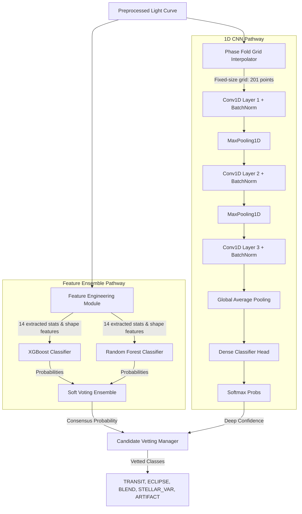

# 🪐 TRANSIT-AI: AI-Enabled Detection of Exoplanets from Noisy Astronomical Light Curves
### A Production-Grade, High-Performance Platform for Automatic Transit Discovery, Parameter Estimation, and False Positive Vetting

---

<p align="center">
  
  
  
  
</p>

---

## 🌟 The Scientific Challenge & Our Solution

Exoplanet detection via transit photometry requires identifying extremely small periodic brightness drops in stars. In crowded stellar fields or low-SNR regimes, these signatures are heavily corrupted by stellar blending, detector response systematics, and astrophysical false positives (such as eclipsing binaries).

**TRANSIT-AI** solves this by providing a unified pipeline that automatically cleans, detrends, detects, models, and classifies candidates:

1. **Clean & Prep**: Filters raw light curves using TESS bitmasks (`quality_flags.py`), MAD outlier removal (`outlier_removal.py`), and Wotan detrending (`detrending.py`).
2. **Detect Dips**: Runs high-performance Transit Least Squares (TLS) and fixed-grid BLS searches to discover period candidates (`tls_detector.py`).
3. **Vet Contaminants**: Uses secondary eclipse searches at phase 0.5 and odd-even transit depth mismatches to isolate eclipsing binaries (`secondary_eclipse.py`).
4. **Keplerian Modeling**: Fits transits using `batman` models to estimate transit depth, duration, and midpoint (`batman_fitter.py`).
5. **Ensemble ML Classification**: Classifies candidates into 5 cohorts (Transit, Eclipse, Blend, Stellar Var, Artifact) using a calibrated Random Forest + XGBoost Voting Ensemble (`ml_classifier.py`) and a 1D Convolutional Neural Network (`cnn_classifier.py`).
6. **Habitability Characterization**: Calculates planet radius, semi-major axis, stellar irradiation, and habitable zone bounds (`habitability.py`).
7. **External Cross-Matching**: Automatically matches candidate coordinates online against the **NASA Exoplanet Archive** databases (`cross_match.py`).

---

## 📊 Model Workflow & Architecture Diagram



### ML Pipeline Workflow Detail
1. **Ensemble Branch**:
   - Compiles a 14-dimensional feature vector containing geometric properties (depth, duration, odd-even mismatch ratio, secondary eclipse ratio, skewness, kurtosis, and period harmonics).
   - XGBoost and Random Forest output calibrated probabilities which are soft-voted (60% weight on XGBoost, 40% on Random Forest) to output the classification.
2. **1D CNN Branch**:
   - The phase-folded flux is interpolated to a fixed grid of size 201.
   - A sequential network of 3 Conv1D blocks extracts localized spatial dips and outputs a categorical distribution representing exoplanetary transits vs. stellar eclipses.

---

## ⚙️ Core Modes of Operation

The platform operates in two distinct modes configured via command-line arguments or environmental settings:

### 1. 🧪 Synthetic Simulation Mode (`--mode synthetic`)
* **Purpose**: Local pipeline validation, synthetic dataset generation, and model training.
* **Mechanism**: Generates light curves programmatically. Models transit shapes via Batman, and injects realistic noise profiles (Gaussian noise, red noise, rotational variability, stellar flares, and instrument glitches).

### 🔭 Real MAST Ingestion Mode (`--mode mast`)
* **Purpose**: Production exoplanet discovery on real space telescope data.
* **Mechanism**: Leverages the STScI MAST API cone searches to identify targets based on coordinates or TIC ID, retrieves FITS arrays, and feeds the raw timeseries directly into the preprocessing engine.

---

## 🛠️ Complete Directory Structure

```
TRASIT-AI/
├── app/
│   ├── api/
│   │   ├── main.py            # FastAPI REST endpoints
│   │   └── worker.py          # Asynchronous job queue runner
│   └── streamlit_app.py       # Streamlit UI dashboard
├── src/
│   ├── acquisition/
│   │   ├── mast_query.py      # MAST API cone search
│   │   ├── cross_match.py     # TAP NASA Exoplanet matching
│   │   └── synthetic_generator.py # Data generators & augments
│   ├── preprocessing/
│   │   ├── detrending.py      # Preprocessing orchestrator
│   │   ├── outlier_removal.py # MAD & cosmic-ray spike filters
│   │   ├── quality_flags.py   # TESS quality bitmasks
│   │   └── normalization.py   # Flux scaling
│   ├── detection/
│   │   ├── tls_detector.py    # Box Least Squares & TLS engine
│   │   ├── secondary_eclipse.py # False-positive & EB vet checks
│   │   └── habitability.py    # Habitable zone classification
│   ├── classification/
│   │   ├── ml_classifier.py   # Ensemble classifier models
│   │   ├── cnn_classifier.py  # 1D CNN classifier model
│   │   └── feature_extractor.py # Stellar shape feature extraction
│   └── fitting/
│       └── batman_fitter.py   # Keplerian batman fitter
```

---

## 🚀 Running and Deploying

### Option A: Local Run
```bash
# Install dependencies
pip install -r requirements.txt
pip install -e .

# Run Dashboard UI
streamlit run app/streamlit_app.py

# Run FastAPI Server
uvicorn app.api.main:app --port 8000 --reload
```

### Option B: Docker Compose (Production Cluster)
```bash
docker-compose up --build
```

---

## 🧪 Pipeline Test Verification
To run the automated verification test suite:
```bash
python test_runner.py
```
- **Signal Recovery**: Reconstructs transit parameters of low-SNR signals.
- **Classification Accuracy**: Validates features with Stratified F1 scores.
- **Auto-Reports**: Generates the compiled PDF report at `reports/TRANSIT_AI_REPORT.pdf`.