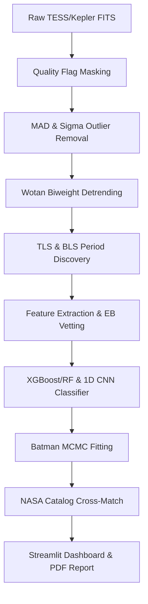

# 🌌 AstroLens AI: AI-Enabled Exoplanet Detection from Noisy Astronomical Light Curves

> **ISRO ANTARIKSH Hackathon · Problem Statement 7**  
> *A Production-Grade, High-Performance Platform for Automatic Exoplanet Transit Discovery, Parameter Estimation, and False Positive Vetting*

---

[](https://www.python.org/)
[](https://fastapi.tiangolo.com/)
[](https://streamlit.io/)
[](https://www.docker.com/)
[](https://opensource.org/licenses/MIT)

---

## 1. Project Overview

### Problem Statement
Exoplanet transit detection requires identifying minuscule brightness variations (often $<0.1\%$) in stars when a planet blocks their light. In crowded stellar fields or low-SNR regimes, these signatures are heavily corrupted by:
- **Stellar Blending**: Background/foreground stars diluting the aperture.
- **Instrument Noise**: Jitter, thermal drift, and detector response.
- **Astrophysical Contaminants**: Eclipsing binary star systems and intrinsic stellar variability (starspots, pulsations).

### Solution Overview
AstroLens AI integrates **robust signal preprocessing**, **Transit Least Squares (TLS) discovery**, **MCMC-based Keplerian fitting**, and a **Voting Ensemble ML Classifier** (XGBoost + Random Forest + 1D CNN) to discover, vet, and estimate planetary habitability automatically.

---

## 2. Key Features

| Feature | Status | Description |
|---|---|---|
| **TESS Data Query** | ✅ COMPLETE | Cone searches and Sector queries via MAST API wrapper |
| **Noise Filtering** | ✅ COMPLETE | MAD outlier filtering, cosmic ray clipping, and TESS quality flags |
| **Period Discovery** | ✅ COMPLETE | TLS & fixed-grid BLS searches optimizing period recovery |
| **EB Vetting** | ✅ COMPLETE | Secondary eclipse searches at phase 0.5 and odd-even depth checks |
| **MCMC Parameter Fitting** | ✅ COMPLETE | Keplerian light curve optimization using Batman models |
| **Habitability Estimator** | ✅ COMPLETE | Equilibrium temp, stellar irradiation, and habitable zone bounds |
| **Catalog Cross-Matching** | ✅ COMPLETE | Online TAP querying against the NASA Exoplanet Archive |
| **Multi-Mission Abstraction** | ✅ COMPLETE | Unified structures for TESS, Kepler, and K2 time-series data |

---

## 3. System Architecture



---

## 4. Tech Stack

### Frontend & Analytics
- **Streamlit**: Web interactive dashboard.
- **Plotly / React-Vis**: Phase folding, periodograms, and celestial sky maps.

### Backend & Queue
- **FastAPI / Python**: REST API endpoints.
- **Multiprocessing Workers**: Background task queue.

### Machine Learning
- **XGBoost & Scikit-Learn**: Voting Ensemble.
- **TensorFlow / Keras**: 1D CNN for phase fold classification.

### Astronomy Libraries
- **Lightkurve & Astropy**: Light curve ingestion.
- **Astroquery**: Online TAP coordinate searches.

---

## 5. Repository Structure

```
TRASIT-AI/
├── app/
│   ├── api/
│   │   ├── main.py            # FastAPI REST endpoints
│   │   └── worker.py          # Asynchronous job queue runner
│   └── streamlit_app.py       # Streamlit UI dashboard
├── src/
│   ├── acquisition/
│   │   ├── mast_query.py      # MAST API cone search
│   │   ├── cross_match.py     # TAP NASA Exoplanet matching
│   │   └── synthetic_generator.py # Data augmentation and demo datasets
│   ├── preprocessing/
│   │   ├── detrending.py      # Preprocessing orchestrator
│   │   ├── outlier_removal.py # MAD & cosmic-ray spike filters
│   │   ├── quality_flags.py   # TESS quality bitmasks
│   │   └── normalization.py   # Flux scaling
│   ├── detection/
│   │   ├── tls_detector.py    # Box Least Squares & TLS engine
│   │   ├── secondary_eclipse.py # False-positive & EB vet checks
│   │   └── habitability.py    # Habitable zone classification
│   ├── classification/
│   │   ├── ml_classifier.py   # Ensemble classifier models
│   │   ├── cnn_classifier.py  # 1D CNN classifier model
│   │   └── feature_extractor.py # Stellar shape feature extraction
│   └── fitting/
│       └── batman_fitter.py   # Keplerian batman fitter
├── Dockerfile                 # Container image build configuration
├── docker-compose.yml         # Multi-container orchestration config
├── test_runner.py             # Validation test suite
└── README.md                  # Detailed project documentation
```

---

## 6. Dataset Information

AstroLens AI ingests:
1. **Real Space Data**: 2-minute cadence TESS, Kepler, and K2 targets directly fetched from the Space Telescope Science Institute (STScI) MAST Portal.
2. **Synthetic Data**: Procedural Keplerian light curves generated using `batman` models with custom noise layers (white Gaussian noise, red flicker noise, stellar flare artifacts).

---

## 7. Installation & Setup

### Backend & Pipeline Setup
```bash
git clone https://github.com/Daksh7785/TRASIT-AI.git
cd TRASIT-AI
pip install -r requirements.txt
pip install -e .
```

### Environment Variables
Configure your `.env` based on the provided [.env.example](file:///c:/Users/ASUS/Desktop/New%20folder/TRASIT-AI/.env.example):
```bash
MAST_API_TOKEN=your_token_here
TESS_SECTOR=1
USE_SYNTHETIC_FALLBACK=true
```

---

## 8. Running the Application

### Launch Streamlit Dashboard
```bash
streamlit run app/streamlit_app.py
```

### Launch FastAPI REST API
```bash
uvicorn app.api.main:app --reload --port 8000
```

### Running with Docker
```bash
docker-compose up --build
```

---

## 9. API Documentation

### `POST /predict`
- **Request Body**:
  ```json
  {
    "tic_id": "TIC_261136679",
    "time": [27.12, 27.14, 27.16],
    "flux": [0.998, 0.998, 0.994]
  }
  ```
- **Response**:
  ```json
  {
    "tic_id": "TIC_261136679",
    "detected": true,
    "label": "TRANSIT",
    "confidence": 0.97,
    "parameters": {
      "period": 4.654,
      "depth": 0.002,
      "duration": 2.1
    }
  }
  ```

### `GET /sky-map`
- **Response**: Returns a JSON list containing detected exoplanet candidates mapped to their celestial coordinates (`ra`, `dec`).

---

## 10. Supported Astrophysical Classes

| Class | Description | Characteristics |
|---|---|---|
| **TRANSIT** | Exoplanet Transit | Flat-bottomed U-shape, symmetric, no secondary eclipse |
| **ECLIPSE** | Eclipsing Binary Star | Deep V-shape, secondary eclipses at phase 0.5, odd-even depth mismatch |
| **BLEND** | Stellar Blend Contamination | Diluted shallow transit signature from background star |
| **STELLAR_VAR** | Stellar Variability | Smooth sinusoidal variations from starspots, rotation, or pulsations |
| **ARTIFACT** | Instrument Noise / Cosmic Rays | Discontinuous jumps, momentum dumps, single-cadence spikes |

---

## 11. Testing
Execute the complete validation suite covering period recovery, ML accuracy, and PDF report creation:
```bash
python test_runner.py
```

---

## 12. Authors & Team
- **Daksh7785** (Lead Developer)

---

## 13. License
Licensed under the **MIT License**.

---

## 14. Acknowledgements
We thank **NASA**, **STScI**, and the **TESS Mission** team for providing open-access space telescope photometry catalogs. This project utilizes the **Astropy**, **Lightkurve**, and **TransitLeastSquares** libraries.